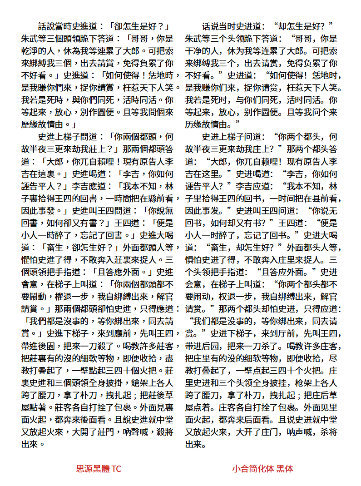
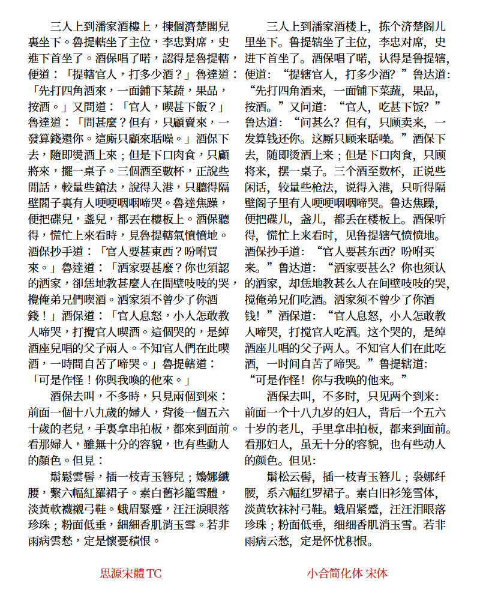

# Xiaohe Simplify Fonts 小合简化体字体
包含 **Xiaohe Simplify Sans | 小合简化体 黑体，Xiaohe Simplify Serif | 小合简化体 宋体。**
由[思源黑体](https://github.com/adobe-fonts/source-han-sans)、[思源宋体](https://github.com/adobe-fonts/source-han-serif)简体版修改，繁入简出的字体。
## 预览
▼ 图中左侧为**思源黑体/宋体TC Regular**，右侧为**小合简化体 黑体/宋体 Regular**，文本内容为繁体[《水滸全傳》第三回](http://open-lit.com/html/lit/19/875.html)。
  
  
## 下载字体
1. 可从本站 [Releases](https://github.com/GuiWonder/XiaoheSimplifyFonts/releases) 页面下载字体。
2. 可从[腾讯微云](https://share.weiyun.com/VEoOc5xK)下载 XiaoheSimplify 系列字体。
## 使用说明
1. 小合简化体可用于不熟悉繁体字的人阅读繁体文章时减轻负担。
2. 字体可根据文本内容动态匹配一繁多简的情况，此功能需要 OpenType 特性的支持。
3. 字体繁简转换的准确率较高，但仍会有出错的可能，因此**不建议在重要场合使用**。
4. 小合简化体遵循 **OFL-1.1 协议**。
## 本项目用到的项目
* [Adobe Fonts](https://github.com/adobe-fonts) [思源黑体](https://github.com/adobe-fonts/source-han-sans) [思源宋体](https://github.com/adobe-fonts/source-han-serif)
* [otfcc](https://github.com/caryll/otfcc)
* [AFDKO](https://github.com/adobe-type-tools/afdko/)
* [Open Chinese Convert](https://github.com/BYVoid/OpenCC) 
## 关于作者
- **Email：** chunfengfly@outlook.com
